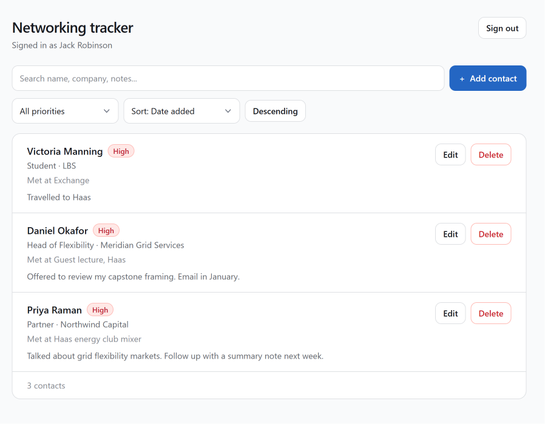
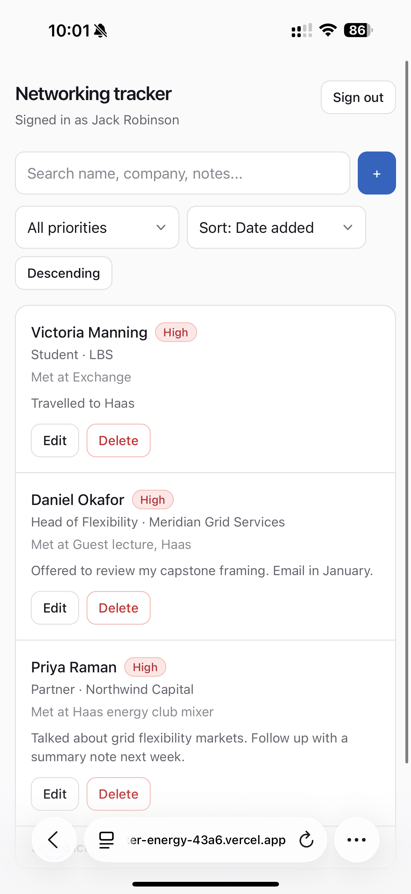
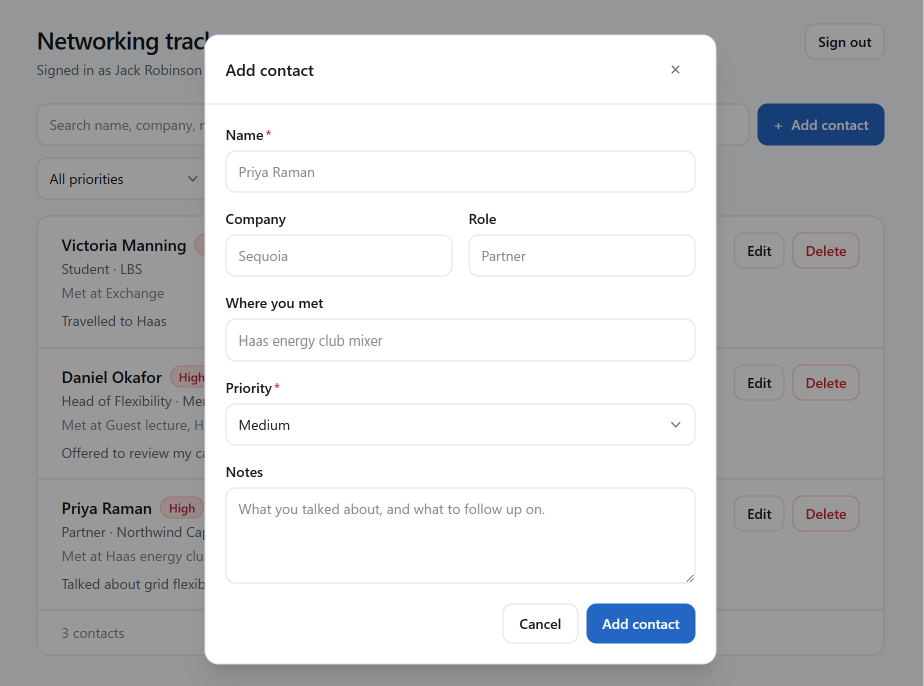
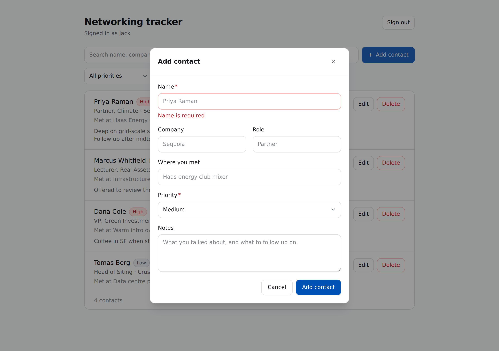
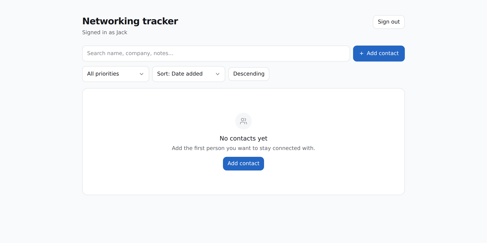
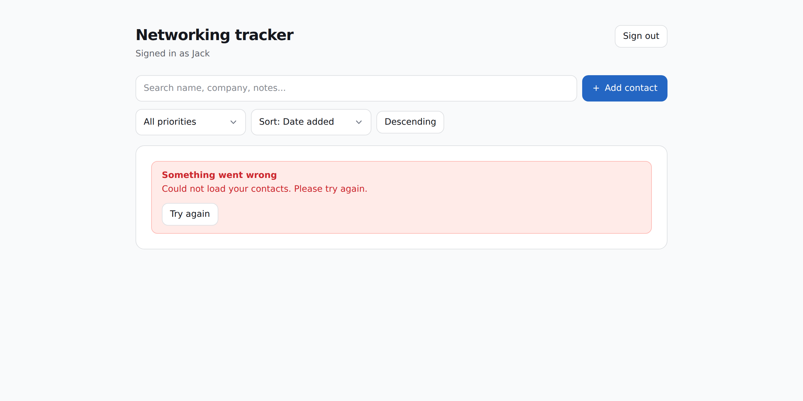
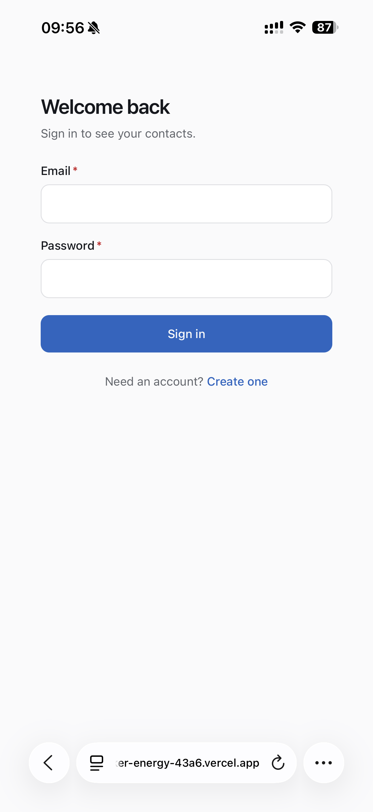
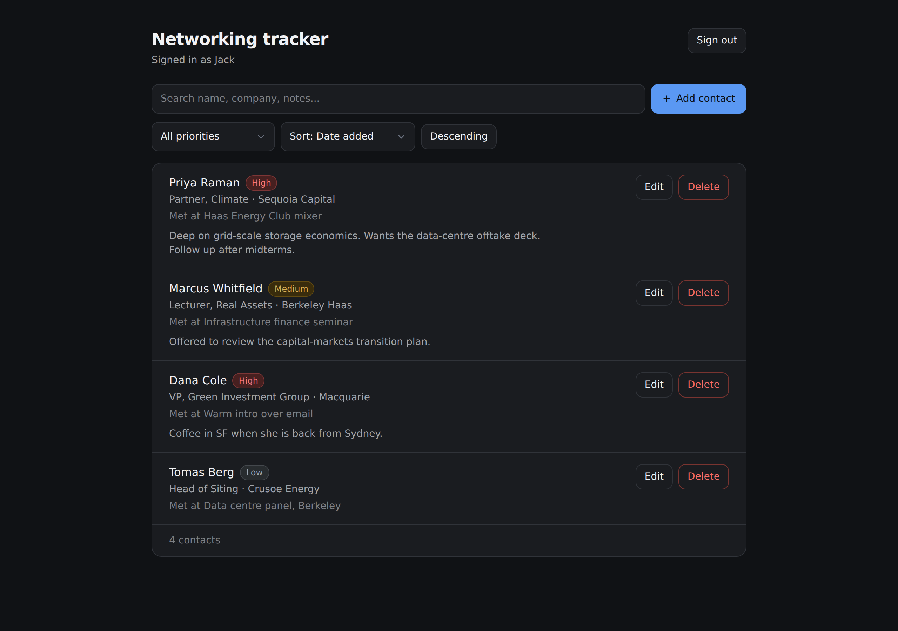

# Berkeley Networking Tracker

A private, per-user tracker for the people I want to stay connected with at Berkeley. Each signed-in user gets their own contact list — name, company, role, where we met, notes, and a priority — which they can create, view, sort, filter, edit and delete. Data lives in Neon (Lakebase) Postgres and survives refreshes, sessions and devices. The interesting part of this project is not the CRUD; it is that **the browser is allowed to talk to the database's public REST endpoint directly, and Row Level Security is what makes that safe**. Ownership is enforced by Postgres policies keyed on the JWT's subject claim, not by application code, so no bug in a route handler can expose one user's contacts to another.

**Live app:** <https://networking-tracker-energy-43a6.vercel.app>

---

## Contents

- [Screenshots](#screenshots)
- [Features](#features)
- [Technology stack, and why](#technology-stack-and-why)
- [Architecture](#architecture)
- [Database schema](#database-schema)
- [Authentication and RLS ownership](#authentication-and-rls-ownership)
- [Request flow, end to end](#request-flow-end-to-end)
- [Local setup](#local-setup)
- [Environment variables](#environment-variables)
- [Tests](#tests)
- [Grading evidence](#grading-evidence)
- [Production verification](#production-verification)
- [Deployment](#deployment)
- [Known limitations, and what I would do next](#known-limitations-and-what-i-would-do-next)

---

## Screenshots

> **Provenance.** These images are being replaced with captures from the live
> URL as they are taken. `sign-in-light.png` is a real capture, taken on a
> phone against the deployed app. The remainder still come from a local build
> with the Data API mocked -- real components and real CSS, but not real rows.
> Either way the deployed app has been verified by measurement rather than by
> screenshot: see [Production verification](#production-verification).

| Contact list (desktop) | Contact list (mobile) |
| --- | --- |
|  |  |

| Add / edit dialog | Invalid input failing safely |
| --- | --- |
|  |  |

| Empty state | Error state |
| --- | --- |
|  |  |

| Sign in | Dark theme |
| --- | --- |
|  |  |

---

## Features

**Accounts**

- Email and password sign-up, sign-in and sign-out via Neon Managed Better Auth
- Sessions persist across refreshes and browser restarts
- Signed-out visitors are sent to the sign-in screen; signed-in visitors land on their contacts

**Contacts**

- Create a contact with name, company, role, where you met, notes and priority
- Priority is constrained to `high`, `medium` or `low` in three independent places (client, server, database)
- Edit any field of your own contacts; delete with a confirmation step
- Sort by date added, name, company or priority, ascending or descending
- Filter by priority, and free-text search across name, company, role, where-met and notes
- Contacts persist in Postgres and survive a refresh

**Interface states** — every asynchronous path has a designed state, not a blank screen:

| State | What you see |
| --- | --- |
| Loading | Skeleton rows shaped like real contacts |
| Empty (no contacts) | Prompt to add the first person, with a button |
| Empty (filters match nothing) | Different copy, plus a "clear filters" action |
| Success | Green banner that auto-dismisses after four seconds |
| Error | Red banner with the reason and a "try again" button |
| Field validation | Inline message under the field, red border, `role="alert"` |

**Interface quality**

- Responsive from 320px up: stacked cards on mobile, wider rows on desktop
- Light and dark themes, both driven by the same semantic design tokens
- 44px minimum touch targets on mobile; 16px inputs so iOS Safari does not zoom on focus
- Keyboard accessible: visible focus ring, Escape closes the dialog, focus moves into the dialog on open
- `prefers-reduced-motion` respected

---

## Technology stack, and why

| Layer | Choice | Why this one |
| --- | --- | --- |
| Framework | **Next.js 16** (App Router) | One project gives me a React frontend and real server-side route handlers, which is what lets validation live in trusted code without standing up a second service. Also the least friction to deploy on Vercel. |
| Language | **TypeScript**, strict | The contact shape is inferred from the Zod schema, so the form, the API routes and the tests cannot drift apart without a compile error. |
| Styling | **Tailwind CSS v4** with a token-based component system in `src/components/ui` | Every primitive is styled from semantic tokens (`surface`, `ink`, `border`, `accent`) rather than raw colours, so dark mode is a token swap rather than a second set of classes. See the [note below](#a-note-on-the-component-system) on why this is hand-built. |
| Database | **Neon (Lakebase) Postgres** | Serverless, branchable, and the free tier scales to zero. Branching matters here: each branch gets its own isolated auth environment, so I can test against a copy of production without touching real users. |
| Auth | **Neon Managed Better Auth** | Users and sessions live in Postgres under the `neon_auth` schema, and it issues a JWT whose `sub` claim Postgres reads back as `auth.user_id()`. That single fact is what makes RLS possible without me writing any token plumbing. |
| Data access | **Neon Data API** (PostgREST) via `@neondatabase/neon-js` | A REST interface over the database that respects RLS and the caller's JWT. It is what allows the "safe to expose to the browser" design below. |
| Validation | **Zod v4** | One schema, imported by the client form, the API routes and the tests. |
| Tests | **Vitest** | Zero config for a TypeScript module, and fast enough to run on every save. |
| Hosting | **Vercel** | First-party Next.js support; preview deployments per branch pair naturally with Neon branches. |

### A note on the component system

The assignment asks for "a design or component system". I originally intended to use **shadcn/ui**, but the environment I built in blocks outbound requests to `ui.shadcn.com`, so `shadcn init` could not fetch the registry. Rather than ship something half-installed, I built the primitives by hand in `src/components/ui/index.tsx`: `Button`, `Input`, `Textarea`, `Select`, `Field`, `Card`, `Alert`, `PriorityBadge`, `EmptyState`, `Spinner` and `ContactsSkeleton`.

They follow the same discipline a component library would enforce — variants and sizes as typed props, a single focus-ring rule, no colour literals outside the token block in `globals.css`, and every component accepting `className` for layout without forking. The token block is the design system; the components are its API.

---

## Architecture

```
Browser (React client components)
  |
  |  1. sign in / sign out          ->  Neon Managed Better Auth  (public HTTPS URL)
  |                                     issues a JWT; sub = user id
  |
  |  2. every request carries that JWT
  v
Next.js route handlers  /api/contacts, /api/contacts/[id]     <-- trusted server code
  |    - reject requests with no bearer token (401)
  |    - validate the body with the shared Zod schema (400 + field errors)
  |    - hold NO service key and NO Postgres connection string
  |    - forward the CALLER'S token onward, so they gain no extra authority
  v
Neon Data API (PostgREST, public HTTPS URL)
  |    verifies the JWT, opens the connection as the `authenticated` role
  v
Neon Postgres  -- public.contacts
       Row Level Security decides which rows the statement can touch
       CHECK constraints decide whether the row is valid at all
```

**Frontend and backend are separated** along the trust boundary, not just across files. `src/components` and `src/app/**/page.tsx` are the frontend: they render, collect input, and are assumed to be under the user's control. `src/app/api/**/route.ts` is the backend: it re-validates everything and is the only place a write is allowed to originate.

The deliberate design decision worth defending: **the route handlers are trusted, but not privileged.** They could have connected to Postgres with `DATABASE_URL` and full table access, then filtered rows in JavaScript. They do not. They forward the caller's own JWT to the Data API, so every statement they issue is subject to exactly the same RLS policies as a request made directly from the browser. The consequence is that the blast radius of a route-handler bug is zero: a handler that forgot a `WHERE user_id = ...` clause still cannot read another user's rows, because the database refuses.

### Project layout

```
neon.ts                          infrastructure as code: declares Auth + Data API
db/migrations/0001_contacts.sql  table, constraints, RLS policies
scripts/migrate.mjs              applies migrations (the only DATABASE_URL consumer)
scripts/privacy-test.mjs         two-account RLS proof against the live Data API
src/
  app/
    page.tsx                     routes you to /contacts or /sign-in
    sign-in/, sign-up/           auth screens
    contacts/page.tsx            session gate + main view
    api/contacts/route.ts        GET list (sort/filter), POST create
    api/contacts/[id]/route.ts   PATCH update, DELETE
    globals.css                  design tokens, light + dark
  components/
    ui/index.tsx                 the component system
    auth-form.tsx                sign-in / sign-up form
    contacts-view.tsx            list, search, sort, filter, mutations
    contact-form.tsx             create / edit dialog
  lib/
    validation.ts                Zod schemas + sort/filter allow-lists  <-- tested
    neon-client.ts               browser client (two-URL object form)
    neon-server.ts               per-request server client, scoped to a caller's token
tests/validation.test.ts         27 tests
```

---

## Database schema

`public.contacts`:

| Column | Type | Constraints | Notes |
| --- | --- | --- | --- |
| `id` | `uuid` | primary key, `default gen_random_uuid()` | Server-generated; a client-supplied `id` is stripped before the insert. |
| `user_id` | `text` | **`not null`, `default auth.user_id()`** | The ownership column. `text`, not `uuid`, because Better Auth user ids are text. Never sent by the client. |
| `name` | `text` | `not null`, `check (length(btrim(name)) > 0)`, `check (length(name) <= 200)` | `btrim` is what makes `"   "` fail rather than pass as non-empty. |
| `company` | `text` | nullable | |
| `role` | `text` | nullable | |
| `where_met` | `text` | nullable | |
| `notes` | `text` | nullable | |
| `priority` | `text` | `not null`, `default 'medium'`, `check (priority in ('high','medium','low'))` | |
| `created_at` | `timestamptz` | `not null`, `default now()` | |
| `updated_at` | `timestamptz` | `not null`, `default now()` | Maintained by the `contacts_set_updated_at` trigger. |

Index: `contacts_user_id_created_at_idx on contacts (user_id, created_at desc)` — every query is "my contacts, in some order", so the index leads with the ownership column.

Full DDL: [`db/migrations/0001_contacts.sql`](db/migrations/0001_contacts.sql).

---

## Authentication and RLS ownership

### How identity reaches the database

1. A user signs in through Managed Better Auth, which stores users and sessions in Postgres under the `neon_auth` schema.
2. The browser asks Better Auth for a short-lived **JWT**. Its `sub` claim is that user's id.
3. Every Data API request carries `Authorization: Bearer <jwt>`.
4. The Data API verifies the token and opens the connection as the Postgres role **`authenticated`**, exposing the token's subject to SQL as **`auth.user_id()`**.

So `auth.user_id()` is not something the application sets. It is derived from a signed token the client cannot forge, and it is the same value in every policy below.

### The ownership rule

**A row belongs to the user whose id is in its `user_id` column, and a signed-in user may only see or change rows where `auth.user_id() = user_id`.**

RLS is enabled *and forced*:

```sql
alter table public.contacts enable row level security;
alter table public.contacts force  row level security;   -- applies to the table owner too
```

Table privileges are granted narrowly, because RLS only filters rows a role is already allowed to touch:

```sql
grant select, insert, update, delete on public.contacts to authenticated;
revoke all on public.contacts from anonymous;
```

Four separate policies, one per command:

```sql
create policy contacts_select_own on public.contacts
  for select to authenticated
  using ((select auth.user_id()) = user_id);

create policy contacts_insert_own on public.contacts
  for insert to authenticated
  with check ((select auth.user_id()) = user_id);

create policy contacts_update_own on public.contacts
  for update to authenticated
  using      ((select auth.user_id()) = user_id)     -- which rows I may target
  with check ((select auth.user_id()) = user_id);    -- what they may look like after

create policy contacts_delete_own on public.contacts
  for delete to authenticated
  using ((select auth.user_id()) = user_id);
```

Three details that matter:

- **`USING` vs `WITH CHECK`.** `USING` filters the rows a statement is allowed to reach. `WITH CHECK` validates the row *after* the write. The `UPDATE` policy needs both: `USING` stops me from targeting your row, and `WITH CHECK` stops me from taking my own row and rewriting `user_id` to yours — an ownership transfer that `USING` alone would happily permit.
- **`INSERT` needs `WITH CHECK` and cannot use `USING`.** There is no pre-existing row to filter, so the only question is whether the new row is allowed to exist. Combined with `default auth.user_id()`, a client that sends no `user_id` gets the correct one, and a client that sends someone else's is rejected.
- **`(select auth.user_id())`** wraps the call in a scalar subquery so Postgres evaluates it once per statement instead of once per row.

### Why exposing the Data API URL is safe

`NEXT_PUBLIC_NEON_AUTH_URL` and `NEXT_PUBLIC_NEON_DATA_API_URL` are compiled into the JavaScript bundle and visible to anyone who opens devtools. That is fine, and it is the intended design: they are **addresses, not credentials**. Neither returns a single row without a valid JWT, and which rows a valid JWT can reach is decided entirely by the policies above. The Postgres connection string is a different matter — it *is* a credential, it grants unrestricted access, and it appears nowhere in `src/`. The only file that reads it is `scripts/migrate.mjs`, a developer command that never runs in the app or the build.

You can verify this claim rather than take my word for it:

```bash
npm run build
grep -r "postgresql://\|DATABASE_URL" .next/static/   # returns nothing
grep -rn "DATABASE_URL" src/                          # returns nothing
```

---

## Request flow, end to end

Creating a contact, as an example:

1. The dialog runs `validateContactInput` from `src/lib/validation.ts` and shows inline errors. **This is a convenience, not a control** — it can be bypassed with devtools.
2. The client asks Better Auth for a JWT and `POST`s to `/api/contacts` with `Authorization: Bearer <jwt>`.
3. `src/app/api/contacts/route.ts` rejects the request with **401** if there is no bearer token, then runs the *same* Zod schema. On failure it returns **400** with per-field messages that the dialog renders under the offending inputs.
4. The handler builds a Data API client scoped to that caller's token and inserts the validated fields. It deliberately sends **no `user_id`**.
5. Postgres fills `user_id` from `auth.user_id()`, the `INSERT` policy's `WITH CHECK` confirms the row belongs to the caller, and the `CHECK` constraints confirm the name is non-blank and the priority is one of three values.
6. The created row comes back and the list reloads.

Reads take the same path with sort and filter values checked against allow-lists (`isSortField`, `isPriority`) before they reach the query string, so an unexpected value falls back to a default instead of being interpolated into a PostgREST expression.

Notice there is no ownership check anywhere in step 3 or 4. Asking for a contact that belongs to someone else returns **404**, not because the handler compared ids, but because RLS filtered the row out and the update matched zero rows. A 404 rather than a 403 is intentional: a 403 would confirm that someone else's contact exists.

---

## Local setup

**Prerequisites:** Node 20+, a Neon account, the Neon CLI (`npm i -g neon`).

```bash
# 1. Clone and install
git clone https://github.com/jcrobbo1007/networking-tracker.git
cd networking-tracker
npm install

# 2. Link the workspace to your Neon project and branch
neon login
neon link            # writes a gitignored .neon file

# 3. Provision Managed Better Auth and the Data API from neon.ts,
#    then pull the branch's env vars into .env.local
neon deploy

# 4. `neon deploy` writes .env.local, but under Neon's own variable names:
#    NEON_AUTH_BASE_URL and NEON_DATA_API_URL. This app reads the
#    NEXT_PUBLIC_ names, so add them alongside (same values, and both are
#    public by design -- see Environment variables below):
#      NEXT_PUBLIC_NEON_AUTH_URL      = NEON_AUTH_BASE_URL
#      NEXT_PUBLIC_NEON_DATA_API_URL  = NEON_DATA_API_URL

# 5. Apply the schema and RLS policies
npm run db:migrate

# 6. Allow sign-in from localhost during development
#    (`allow-localhost` needs the `enable` sub-command; without it the CLI
#    exits 0 and silently does nothing)
neon neon-auth domain allow-localhost enable
neon neon-auth domain allow-localhost get   # -> Allow localhost: true

# 7. Run it
npm run dev          # http://localhost:3000
```

`npm run db:migrate` prints what it created, so the run verifies itself:

```
Row Level Security on public.contacts:
  enabled: true   forced: true

Policies (4):
  DELETE  contacts_delete_own
  INSERT  contacts_insert_own
  SELECT  contacts_select_own
  UPDATE  contacts_update_own
```

---

## Environment variables

Names only — real values live in `.env.local`, which is gitignored. See [`.env.example`](.env.example).

| Variable | Exposure | Used by | Purpose |
| --- | --- | --- | --- |
| `NEXT_PUBLIC_NEON_AUTH_URL` | **Public** (in the browser bundle) | `src/lib/neon-client.ts` | Managed Better Auth endpoint for sign-up, sign-in, sign-out and JWT issuance. |
| `NEXT_PUBLIC_NEON_DATA_API_URL` | **Public** (in the browser bundle) | `src/lib/neon-client.ts`, `src/lib/neon-server.ts` | PostgREST endpoint for contact rows. Protected by RLS. |
| `DATABASE_URL` | **Server-only, secret** | `scripts/migrate.mjs` only | Direct Postgres connection for applying migrations. Never referenced by application code or by the build. |

`NEON_AUTH_BASE_URL` and `NEON_AUTH_COOKIE_SECRET` are not used: this implementation authenticates the browser directly against Managed Better Auth using `createClient`'s two-URL object form, rather than proxying auth through a Next.js route with a server-held cookie secret. Because there is no server-side auth proxy, there is no cookie secret to keep. See [Known limitations](#known-limitations-and-what-i-would-do-next) for the trade-off.

`.gitignore` ignores `.env*` with a single deliberate exception, `!.env.example`.

---

## Tests

```bash
npm test              # Vitest, 27 tests, no network or database needed
npm run test:privacy  # two-account RLS proof against the live Data API
```

### `npm test` — validation

`tests/validation.test.ts` exercises `src/lib/validation.ts`, the **same module the API route handlers import**, so a passing run is evidence about the enforcing code path rather than a parallel copy of it. It covers:

- **Empty names fail** — empty string, whitespace-only (`"   "`), missing entirely, and over 200 characters, each with the exact message the UI renders
- **Invalid priorities fail** — `"urgent"`, `"HIGH"` (right word, wrong case), `""`, a number, `null`, and missing
- Valid priorities (`high`, `medium`, `low`) pass; names are trimmed
- Blank optional fields become `null` rather than `""`
- **A client-supplied `user_id` or `id` is stripped** rather than trusted — the schema-level half of the ownership guarantee
- Partial updates still enforce every rule, and an empty patch is rejected
- Sort and filter allow-lists reject unknown values, including `"name; drop table contacts"`

```
 ✓ tests/validation.test.ts > validateContactInput -- name > rejects an empty name with a clear message
 ✓ tests/validation.test.ts > validateContactInput -- name > rejects a whitespace-only name (not just a zero-length string)
 ✓ tests/validation.test.ts > validateContactInput -- priority > rejects 'urgent'
 ✓ tests/validation.test.ts > validateContactInput -- priority > rejects 'HIGH'
 ✓ tests/validation.test.ts > validateContactInput -- ownership cannot be set by the client > strips user_id from the payload instead of trusting it
 ✓ tests/validation.test.ts > sort and filter allow-lists > rejects an unknown sort field, so it can never reach the query string

 Test Files  1 passed (1)
      Tests  27 passed (27)
```

Full output: [`docs/test-output.txt`](docs/test-output.txt).

### `npm run test:privacy` — two-account isolation

`scripts/privacy-test.mjs` signs in two accounts and then talks **straight to the public Data API**, bypassing this app's API routes entirely. That is the point: if the only thing stopping User B from reading User A's contacts were an `if` statement in a route handler, this script would sail past it. Every assertion therefore tests Row Level Security itself.

It checks that:

1. `user_id` defaults to A's id without the client sending one
2. A can read their own row
3. B's contact list does not contain A's row
4. Selecting **A's exact row id** as B returns nothing
5. Updating A's row as B changes nothing
6. Deleting A's row as B removes nothing
7. Inserting as B with `user_id` spoofed to A is rejected
8. A cannot reassign their own row's `user_id` to B, and the row still belongs to A afterwards
9. A request with **no token** returns no rows
10. A blank name and an invalid priority are rejected by the database's `CHECK` constraints, independently of the API routes

Run against the live Neon `production` branch (project `bitter-moon-70893420`),
with the deployed origin `https://networking-tracker-energy-43a6.vercel.app`:

```
Two-account privacy test
Data API: https://ep-wild-snow-aku1yw6o.apirest.c-3.us-west-2.aws.neon.tech/neondb/rest/v1

Signing in two accounts:
  User A: rls-a-d7343af7@example.com  (user id c61140a4-a713-4e06-a1d4-ae30f121d7b9)
  User B: rls-b-d7343af7@example.com  (user id 2e25d99a-eefc-4274-8c60-ee41aeacc2f3)

User A creates a private contact:
  created 13ade0f3-e5d1-48d7-8ea9-065b78342e91
  PASS  user_id defaulted to User A's id without the client sending it

User A can reach their own row:
  PASS  SELECT returns the row for its owner

User B attacks User A's row:
  PASS  B's full contact list does not contain A's row
  PASS  SELECT by A's exact row id returns nothing for B
  PASS  UPDATE of A's row changes nothing for B
  PASS  DELETE of A's row removes nothing for B
  PASS  INSERT with user_id spoofed to A is rejected

User A cannot give a row away:
  PASS  UPDATE that reassigns user_id to B is rejected
  PASS  the row still belongs to A afterwards

Signed-out requests:
  PASS  SELECT with no token returns no rows

Database-level validation (independent of the API routes):
  PASS  blank name rejected by the CHECK constraint
  PASS  invalid priority rejected by the CHECK constraint

12 passed, 0 failed
```

The two assertions that carry the most weight are the spoofed `INSERT` and the
attempted ownership transfer. Both are refused by Postgres, not by application
code -- the script never touches this app's API routes.

---

## Grading evidence

| Requirement | Where to find it |
| --- | --- |
| Automated test output, at least one passing validation test | [Tests](#tests) above, and [`docs/test-output.txt`](docs/test-output.txt) — 27 passing |
| Sign-in and sign-out |  · sign-out button top-right of [the contact list](docs/screenshots/contacts-desktop.png) |
| Create, edit, delete, refresh a contact | [Add/edit dialog](docs/screenshots/contact-form.png) and [the list](docs/screenshots/contacts-desktop.png); contacts persist because they are rows in Postgres, not client state |
| Two-account test: one user cannot access the other's contacts | `npm run test:privacy` — see [above](#npm-run-testprivacy--two-account-isolation) |
| One invalid input failing safely |  |
| Contacts schema and RLS ownership rule explained | [Database schema](#database-schema) and [Authentication and RLS ownership](#authentication-and-rls-ownership) |
| No committed secret values | `.gitignore` excludes `.env*` (except `.env.example`, which holds placeholders only); `grep -rn "DATABASE_URL" src/` returns nothing; the built client bundle contains no connection string |

---

## Production verification

Run against the deployed app at the live URL, signed in as a real account.
Every line below is a measured result rather than an expectation.

| Check | Method | Result |
| --- | --- | --- |
| App reachable without a login wall | `curl` + browser | `200`, no redirect to `vercel.com/sso-api` |
| Sign-up rejects a duplicate address | UI | `AuthApiError: User already exists. Use another email.` |
| Session survives a reload | UI | `/contacts` renders "Signed in as ..." after a full refresh |
| Create | `POST /api/contacts` | `201`, row rendered |
| Read | `GET /api/contacts?sort=created_at&direction=desc` | `200` |
| Update | `PATCH /api/contacts/<id>` | `200`, "Contact updated." |
| Delete | `DELETE /api/contacts/<id>` | `200`, row gone from the list |
| Unknown / other-user id | `DELETE /api/contacts/<random uuid>` | **`404`**, not `403` |
| Blank name rejected | UI, whitespace-only name | `Name is required`, inline, no request sent |
| Two-account isolation (script) | `npm run test:privacy` | 12 passed, 0 failed |
| Two-account isolation (live UI) | Two real accounts in two browsers | Account A: 2 contacts. Account B: `200` and **0 rows** |
| Sign-out really ends the session | Click Sign out, then `GET /get-session` | Session cleared (see the 415 note below) |

The `404` matters: a `403` would confirm that someone else's contact exists.
It falls out of RLS returning zero rows, not from an ownership check in code --
there is no such check anywhere in the handlers.

A note on that live two-account check: it happened by accident, which is the
useful part. Two browsers were signed in to two different accounts at the same
time. The account holding two contacts saw both; the other asked the same
endpoint with its own JWT and got an empty list. Neither request was special --
the difference was made in Postgres.

### Three things found only against a live backend

Both were discovered by measurement, and both are recorded in the code:

**The session cookie is cross-site.** Managed Better Auth issues it on its own
`*.neon.tech` origin, so the browser sends it only when a request sets
`credentials: "include"`. The client library's session read does not, so
`GET /get-session` answered `200` with the body `null` -- 753 bytes with
credentials, 4 bytes without. The app concluded nobody was signed in, and
signing in bounced straight back to `/sign-in` in a loop, with every request
returning `200` the whole way. `src/lib/neon-client.ts` therefore calls the Auth
HTTP endpoints directly for session and token reads. Passing `fetchOptions` to
the adapter does not help: `createClient` invokes the adapter builder as
`(url, fetchOptions)` with its own options and discards the factory's.

**Sign-out silently did nothing.** The request carried no content-type, and
Better Auth answers a bare `POST /sign-out` with `415`. The UI navigates to
`/sign-in` regardless and the error was swallowed, so the user appeared signed
out while the session cookie stayed valid and `/get-session` still returned
their account -- reopening `/contacts` signed them straight back in. The request
now sends `content-type: application/json` and a body, and reports whether it
succeeded.

**Credentialed requests must stay "simple".** Neon Auth accepts a credentialed
cross-origin request, but one carrying an unexpected custom header fails its
CORS preflight outright (`TypeError: Failed to fetch`). Those reads therefore
send no custom headers, and none should be added.

---

## Deployment

```bash
# 1. Push to GitHub
git push origin main

# 2. Create the Vercel project and link it, WITHOUT deploying yet.
#    Order matters: NEXT_PUBLIC_ values are inlined at build time, and
#    src/lib/neon-client.ts throws when they are missing. Deploying first
#    would fail the build while prerendering /sign-in, rather than merely
#    producing a broken page.
npx vercel link --yes

# 3. Add the two public variables to Production.
#    Vercel refuses a bare NEXT_PUBLIC_ value and demands an explicit choice;
#    `--type config` is the correct one here, because these URLs are addresses
#    rather than credentials. DATABASE_URL is NOT added: the app never reads it.
npx vercel env add NEXT_PUBLIC_NEON_AUTH_URL     production --type config
npx vercel env add NEXT_PUBLIC_NEON_DATA_API_URL production --type config

# 4. Deploy
npx vercel --prod --yes

# 5. New Vercel projects can have Vercel Authentication enabled by default,
#    which 302s every request to vercel.com/sso-api -- the deployment answers
#    200 to `curl -L` because that is the login page, so check it in a browser,
#    not by status code alone. Turn it off so the URL is publicly openable.
#    This is not what protects the data; RLS is.
npx vercel project protection disable networking-tracker --sso

# 6. Trust the deployed domain in Neon Auth, or sign-in fails there
neon neon-auth domain add https://<your-app>.vercel.app
neon neon-auth domain list

# 7. Re-run the two-account privacy proof against the deployed origin
PRIVACY_TEST_ORIGIN=https://<your-app>.vercel.app npm run test:privacy
```

Then, against the live URL: open it in a private window, create two accounts, and repeat the privacy test in production.

---

## Known limitations, and what I would do next

**Route protection is client-side.** `/contacts` checks the session in a `useEffect` and redirects if there is none. A signed-out visitor briefly sees a spinner rather than being stopped at the edge. This leaks no data — there is nothing to render without a JWT, and RLS refuses the underlying rows regardless — but it is a worse experience than a server-side redirect. Next 16 renamed `middleware.ts` to `proxy.ts`; moving the session check there would fix the flash. I chose the simpler path deliberately, since a proxy that mishandles the session is a worse outcome than a brief spinner.

**Auth is browser-direct rather than proxied.** Using `createClient`'s two-URL object form means the browser talks to Managed Better Auth itself, and the session is held by the Better Auth client rather than in an `httpOnly` cookie set by my own server. Neon's `createNeonAuth` + `authApiHandler` would proxy auth through `/api/auth/[...path]`, keep `NEON_AUTH_BASE_URL` and `NEON_AUTH_COOKIE_SECRET` server-only, and put the session in an `httpOnly` cookie — meaningfully better against XSS. That is the first thing I would change with more time.

**No pagination.** Every contact is fetched on every load. Fine at the scale this is for (tens to low hundreds); at a few thousand it wants keyset pagination on `(user_id, created_at, id)`, which the existing index already supports.

**Search is `ILIKE`, not full-text.** `%term%` cannot use a normal index, so it degrades linearly. A `tsvector` column with a GIN index would be the fix, and Neon supports it.

**Delete uses `window.confirm`.** It works and it is accessible, but it looks like the browser rather than the app. A styled confirmation dialog reusing the existing dialog primitive would be more consistent. Undo would be better still than confirmation.

**Sorting by priority orders `high < low < medium` in raw SQL,** because it is stored as `text`. I sort descending to compensate, which happens to give the right order, but it is fragile. The correct fix is a Postgres `enum` or a numeric `priority_rank` column.

**Only the validation layer is unit-tested.** The route handlers and React components have no automated coverage; the privacy script covers the security boundary end to end, but a Playwright suite driving the real sign-in and CRUD flows would catch regressions the current tests would miss.

**No rate limiting** on sign-up or sign-in. Fine for a class project on a private URL; not fine for anything real.

**The `where_met` field renders as "Met at {value}"**, which reads oddly for values like "Warm intro over email". A neutral label would be better.
